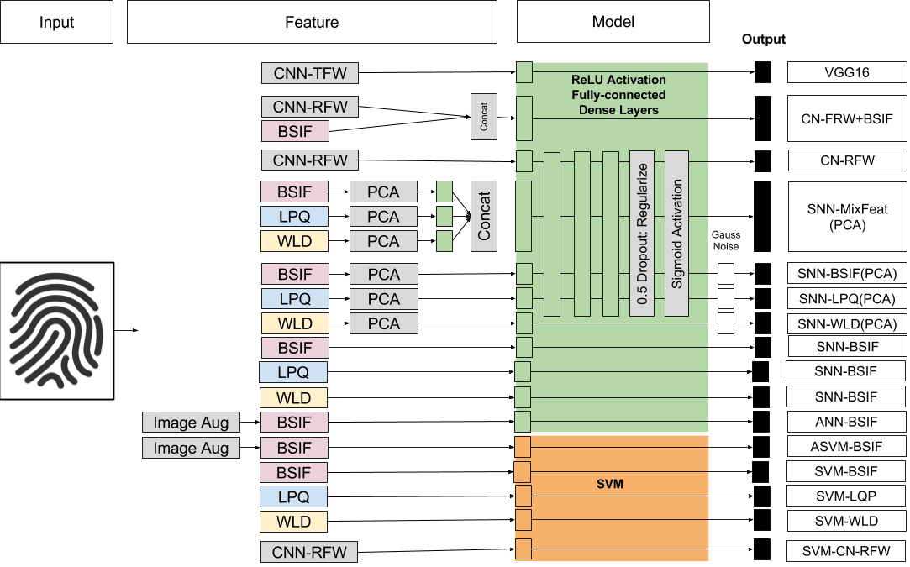

# Fingerprint Liveness Detection Project
## 1. Extract the features
+ Data set contains the fingerprint images from "Liveness Detection Competitions 2015"  [Available Here](http://livdet.org/registration.php).
+ Image augmentation are done by [augment_data.py](augment_data.py)
+ Three feature extractors we applied are:
  + Binary Statistical Image Filter(BSIF), in folder [BSIF_feature](BSIF_feature)
  + Local Phase Quantization(LPQ), in folder [LPQ_feature](LPQ_feature)
  + Weber Local Descriptor(WLD), in folder [WLD_feature](WLD_feature)
  + Convnet-Features(CNN), in [extract_features.py](./convnet-features/extract_features.py)
  
## 2. SVM using sklearn in python
+ Support Vector Machine(SVM) in [svm_classifiy](SVM_classifiy)
  + [svm_fingerpint_liveness_detection_foldval.py](./SVM_classifiy/svm_fingerpint_liveness_detection_foldval.py) conducts Cross Validation.
  + [svm_fingerprint_liveness_detection_2015.py](./SVM_classifiy/svm_fingerprint_liveness_detection_2015.py) makes and tests svm classifier, draws the ROC curve and calculates the AUC values.
  + [convnet_svm.py](./SVM_classifiy/convnet_svm.py) makes and tests svm classifiers for convnet feature.
  + The result images are in [svm_2015_result](./SVM_classifiy/svm_2015_result)

## 3. Neural Network using Keras in python
+ Simple Dense Neural Networks to classify the features:
  + BSIF Features: [bsif_nn](./NeuralNetwork/2015DigPer_test_BSIF.py)
  + LPQ Features: [lpq_nn](./NeuralNetwork/2015DigPer_test_LPQ.py)
  + WLD Features: [eld_nn](./NeuralNetwork/2015DigPer_test_WLD.py)
  + Mixed Features: [mixfeat_nn](./NeuralNetwork/2015DigPer_test_MixFeat.py)
  + Convnet Features: [convnet_nn.py](./NeuralNetwork/convnet_nn.py)  
+ VGG16 model are trained using [train_vgg16.py](./NeuralNetwork/train_vgg16.py)
+ VGG16+vector multibranch models are trained using [train_multi.py](./NeuralNetwork/train_multi.py). Note: merge features first using [merge_features.py](./NeuralNetwork/merge_features.py)
+ their data generator functions can be found in [gen.py](./NeuralNetwork/gen.py)

## Models Tested

