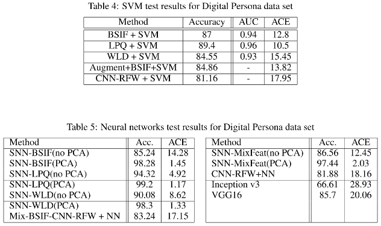

# Fingerprint Liveness Detection Project

In this project, we explored two different methods (SVM & Neural Network) for fingerprint liveness detection. Please change input and output paths in the scripts asvappropriate and run in the order as numbered, bullet points mean scripts can be ran in any order

Data: We use the fingerprint images data set from "Liveness Detection Competitions 2015" [Available Here](http://livdet.org/registration.php).

## 1. Feature extraction

1. (optional, recommended) For the image augmentation, please refer to: [augment_data.py](augment_data.py)
2. Four feature extraction methods applied:
    + Binary Statistical Image Filter(BSIF), in folder [BSIF_feature](BSIF_feature)
    + Local Phase Quantization(LPQ), in folder [LPQ_feature](LPQ_feature)
    + Weber Local Descriptor(WLD), in folder [WLD_feature](WLD_feature)
    + Convnet Features: [convnet_nn.py](./NeuralNetwork/convnet_nn.py)  
  
## 2. SVM using sklearn in python
+ Simple (Support Vector Machine (SVM) models)[SVM_classifiy](SVM_classifiy)
  1. Train and cross validate model: [svm_fingerpint_liveness_detection_foldval.py](./SVM_classifiy/svm_fingerpint_liveness_detection_foldval.py) is for cross validation
  2. Test model, and draw AUC and ROC curves: [svm_fingerprint_liveness_detection_2015.py](./SVM_classifiy/svm_fingerprint_liveness_detection_2015.py)
+ Convnet SVM models:
  1. Extract convnet features: [CNN-RFW](https://github.com/giovanichiachia/convnet-rfw))
  2. Train model: [convnet_svm.py](./SVM_classifiy/convnet_svm.py) is for the CNN feature (result images are in [svm_2015_result](./SVM_classifiy/svm_2015_result))

## 2. Neural Network using Keras in python
Simple Layer Neural Network models (models split based on what deatures they use):
  + BSIF Features: [2015DigPer_test_BSIF.py](./NeuralNetwork/2015DigPer_test_BSIF.py)
  + LPQ Features: [2015DigPer_test_LPQ.py](./NeuralNetwork/2015DigPer_test_LPQ.py)
  + WLD Features: [2015DigPer_test_WLD.py](./NeuralNetwork/2015DigPer_test_WLD.py)
  + Mix Features: [2015DigPer_test_MixFeat.py](./NeuralNetwork/2015DigPer_test_MixFeat.py)

+ VGG16 Neural Network model;
  1. Train and test model: [train_vgg16.py](./NeuralNetwork/train_vgg16.py)

+ VGG16+vector multibranch Neural Neetwork model:
  1. Merge features: [merge_features.py](./NeuralNetwork/merge_features.py)
  2. Train and test model: [train_multi.py](./NeuralNetwork/train_multi.py). 

FYI: Their data generator functions can be found in [gen.py](./NeuralNetwork/gen.py)

## Models

## Results

